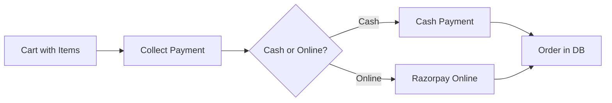

# Order + Payment Flow

Standalone plan for the order creation and payment flow. Complements the [Company POS plan](company_pos_inventory_flow.plan.md).

---

## 1. Order Creation Flow (Overview)




---

## 2. Cart State (Client-Side)

```ts
// types/cart.ts
interface CartItem {
  product_id: string;  // UUID
  product: Pick<Product, 'id' | 'name' | 'price' | 'barcode' | 'currency'>;
  quantity: number;
  unit_price: number;  // snapshot at add-time, paise
  currency: string;  // from product
}

// Local state until "Collect Payment" succeeds
// No DB write until order is created
```

---

## 3. Order + OrderItem (DB Models)

```ts
// types/order.ts
type OrderStatus = 'success' | 'failed' | 'pending';
type PaymentMethod = 'cash' | 'online';

interface Order {
  id: string;  // UUID
  company_id: string;  // UUID
  total_amount: number;  // paise
  currency: string;  // from backend, e.g. '₹'
  status: OrderStatus;
  payment_method: PaymentMethod;
  razorpay_order_id?: string | null;
  razorpay_payment_id?: string | null;
  created_at: string;
}

interface OrderItem {
  id: string;  // UUID
  order_id: string;  // UUID
  product_id: string;  // UUID
  quantity: number;
  unit_price: number;  // paise
  currency: string;  // from backend
}
```

---

## 4. Cash Payment Flow


| Step | Action                                                               |
| ---- | -------------------------------------------------------------------- |
| 1    | User taps "Collect Payment" -> selects "Cash"                        |
| 2    | Create order in Supabase: `orders` (status: success) + `order_items` |
| 3    | Clear cart, show success, navigate back or to orders                 |


No external API. Single Supabase transaction (orders + order_items insert).

---

## 5. Online Payment Flow (Razorpay)


| Step | Action                                                                                                           |
| ---- | ---------------------------------------------------------------------------------------------------------------- |
| 1    | User taps "Collect Payment" -> selects "Online"                                                                  |
| 2    | POST to backend: `company_id`, `amount` (paise), `currency`, `items`                                             |
| 3    | Backend creates order in DB (status: pending), creates Razorpay order, returns `{ order_id, razorpay_order_id }` |
| 4    | App opens Razorpay Checkout with `rzpay_key_id` (from company) and `razorpay_order_id`                           |
| 5    | On success: backend webhook or app callback -> update order status to success                                    |
| 6    | On failure: update order status to failed                                                                        |


---

## 6. Backend API Contract (Online Payment)

**Request:** `POST /api/create-razorpay-order` (or Supabase Edge Function)

```json
{
  "company_id": "uuid",
  "amount": 10000,
  "currency": "₹",
  "items": [
    { "product_id": "uuid", "quantity": 2, "unit_price": 5000 }
  ]
}
```

**Response (success):**

```json
{
  "order_id": "uuid",
  "razorpay_order_id": "order_xxx",
  "amount": 10000,
  "currency": "₹"
}
```

---

## 7. Razorpay Integration by Platform


| Platform          | Approach                                                              |
| ----------------- | --------------------------------------------------------------------- |
| **iOS / Android** | `react-native-razorpay` SDK                                           |
| **Web**           | Razorpay Checkout.js (script) or `react-native-razorpay` web fallback |


Company model: `rzpay_key_id` (Razorpay public key) — required for online payments.

---

## 8. Payment Success / Failure Handling

- **Success:** Update `orders` set `status = 'success'`, optionally store `razorpay_payment_id`
- **Failure:** Update `orders` set `status = 'failed'`
- **Backend:** Consider webhook for payment confirmation (Razorpay sends to your server); app can also poll or receive via callback

---

## 9. Edge Cases to Discuss


| Case                                | Approach                                               |
| ----------------------------------- | ------------------------------------------------------ |
| Company has no `rzpay_key_id`       | Hide "Online" option or show disabled with message     |
| User cancels Razorpay               | Keep order as `pending`; allow retry or mark as failed |
| Network failure during order create | Retry logic; don't clear cart until confirmed          |
| Partial payment failure             | Order stays `pending`; no partial fulfillment          |


---

## 10. File / Implementation Summary


| Item                                        | Notes                                                     |
| ------------------------------------------- | --------------------------------------------------------- |
| `app/(tabs)/company/[id]/create-order.tsx`  | Cart UI, Collect Payment button, Cash/Online modal        |
| `lib/razorpay.ts` or `hooks/useRazorpay.ts` | Platform-aware Razorpay init and checkout                 |
| Supabase: `orders`, `order_items`           | As in main plan                                           |
| Backend API / Edge Function                 | Create order + Razorpay order; return `razorpay_order_id` |

